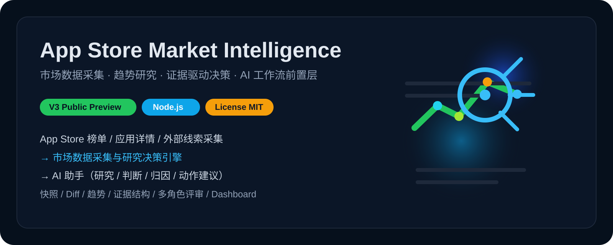

<div align="center">
  
  <h1>App Store Ranking Analysis</h1>
  <p><strong>基于 Node.js 的 App Store 榜单分析与趋势观察工具</strong></p>
  <p>采集榜单、对比变化、生成报告，帮你更快看清中国区 App Store 类目趋势。</p>
  <p>
    
    
    
    
  </p>
</div>

这是一个面向中国区 App Store 的榜单分析系统。

> 如果你不想只看榜单名次，而是想看清哪些类目真的在变化，这个项目会更适合你。

它不是只展示排名的榜单页，而是一条完整的分析链路：

- 先采集榜单和应用详情
- 再做版本化快照和 run 对比
- 再结合趋势和结构化分析整理变化线索
- 最后导出成报告、表格和静态 Dashboard

它主要回答三类问题：

- 最近哪些类目是真的在变，不只是榜单噪音
- 哪些类目值得继续跟踪和观察
- 哪些机会看起来热，但证据还不够，应该先停下来

当前版本：`V3 Public Preview`

## 为什么值得看

很多 App Store 项目只停留在榜单采集、排名展示和报表导出。

这个项目会继续往前走一步，把变化整理成更容易阅读、比较和回看的分析结果。

它会把榜单变化、应用详情、趋势样本和外部线索整理成一套可复核的输出：

- 主分析报告
- 重点类目卡片
- CSV / XLSX / 静态 Dashboard

换句话说，它不是“告诉你谁排第几”，而是“把榜单变化整理成更可用的分析结果”。

## 它适合谁

这个项目当前最适合下面几类人：

- 独立开发者：想先筛掉明显不值得做的 App 方向
- 产品经理：想快速判断某个类目最近是不是真的在变化
- 数据分析或研究场景：需要可复核、可导出的榜单分析结果
- ASO / 市场研究从业者：需要快照、diff、趋势和结构化结论

如果你想找的是在线 SaaS，这不是它。
如果你想找的是一个本地可运行的榜单分析工具，这就是它。

## 3 分钟快速体验

仓库已经带了样例 `run`、分析结果和 Dashboard。第一次体验不需要先抓新数据，可以先直接走样例链路。

### 1. 安装依赖

```bash
npm install
```

### 2. 跑一遍仓库内样例流程

```bash
npm run verify:analysis -- --base-run-id run_2026-04-11_full --target-run-id run_2026-04-13_full --top-n 10
```

### 3. 直接打开样例 Dashboard

```bash
open data/dashboard/run_2026-04-11_full__vs__run_2026-04-13_full/index.html
```

运行后你会直接看到：

- 分析报告：`data/analysis/<analysis_id>/market-analysis.md`
- 重点类目清单：`data/opportunities/<analysis_id>/opportunities.md`
- 表格导出：`data/exports/<analysis_id>/`
- 静态 Dashboard：`data/dashboard/<analysis_id>/index.html`

## 它在整个工作流里的位置

```text
App Store 榜单 / 应用详情 / 外部线索采集 ──► [市场数据采集与研究决策引擎] ──► 你的 AI 助手（研究 / 判断 / 归因 / 动作建议）
                                                     ▲                                                          │
                                                     │                                                          ▼
                                   快照 / Diff / 趋势 / 证据结构 / 多角色评审 ◄────── 报告 / 导出 / Dashboard / 后续验证
```

它位于“原始市场数据”和“分析输出”之间。

它的价值不在于“再多抓一点字段”，而在于把下面这些环节稳定地组织成一条链路：

- 快照
- diff
- 趋势
- 结构化分析
- 报告输出

## 核心主链路

整个标准链路是：

`collect -> diff -> analyze -> opportunities -> export -> dashboard`

对应入口脚本：

- `src/collect.js`
- `src/diff-runs.js`
- `src/analyze-market.js`
- `src/generate-opportunities.js`
- `src/export-insights.js`
- `src/render-dashboard.js`
- `src/run-pipeline.js`

标准数据流：

`runs -> diffs -> analysis -> opportunities -> exports -> dashboard`

## 你能得到什么

### 1. 榜单采集与应用详情补齐

- 采集七麦中国区 iPhone 免费榜、付费榜、畅销榜
- 覆盖多个应用分类，并按分页抓取榜单数据
- 用 Apple Lookup 补齐名称、价格、评分、版本等元数据
- 每次采集都写入版本化快照

### 2. 版本化快照与 run 对比

- 以 `run_id` 组织每次采集
- 维护 `latest` 镜像，方便读取最近一次结果
- 对比两个 run 的新上榜、掉榜、排名变化和应用字段变化

### 3. 趋势增强研究

- 结合历史 run 构建趋势数据
- 区分簇状增长、短期热度、强趋势但脆弱、稳定累积等模式
- 给后续判断提供时间维度支撑

### 4. 分析结果整理

- 榜单变化摘要
- 趋势与风险整理
- 评分与分层结果
- 结构化报告字段

这里的目标不是只给一个分数，而是把变化、趋势、线索和风险整理成更容易阅读的报告内容。

### 5. 多种最终产物

- Markdown
- JSON
- CSV
- XLSX
- 静态只读 Dashboard

这些结果既可以给人直接阅读，也可以继续用于后续处理。

## 当前形态

这个项目当前是：

- Node.js CLI
- 文件系统持久化
- 静态 dashboard
- 单机可运行

## 项目结构

- `src/`：主链路脚本入口
- `src/analysis/`：趋势、评分、报告整理等分析逻辑
- `src/runtime/`：配置与日志
- `tests/`：最小测试与回归
- `docs/`：开发、排障与相关文档
- `data/`：快照、diff、分析结果、导出和 dashboard 产物
- `assets/`：README 视觉素材

## 典型输出

每次完整链路跑完后，通常会得到 5 类结果。

### 1. 市场快照

记录某一次采集到的榜单和应用详情，便于回看和对比。

### 2. 变化对比结果

回答两个时间点之间发生了什么：

- 哪些应用新上榜或掉榜
- 哪些类目波动更明显
- 哪些应用排名变化更快

### 3. 主分析报告

这是最适合直接阅读的核心结果，重点是：

- 当前最值得关注的变化是什么
- 哪些类目更值得继续观察和跟踪
- 风险和证据缺口在哪里

### 4. 类目卡片与分析表

这是最适合继续阅读和比较的结构化结果，包括：

- 重点类目卡片
- 分数与证据拆解
- 趋势与风险摘要

### 5. 表格导出与 Dashboard

如果你更习惯表格和页面浏览，系统还会输出：

- CSV
- Excel 汇总文件
- 静态 HTML Dashboard

常见产物路径：

- `data/analysis/<analysis_id>/market-analysis.md`
- `data/analysis/<analysis_id>/market-analysis.json`
- `data/opportunities/<analysis_id>/opportunities.md`
- `data/opportunities/<analysis_id>/opportunities.json`
- `data/exports/<analysis_id>/`
- `data/exports/<analysis_id>/insights.xlsx`
- `data/dashboard/<analysis_id>/index.html`

## 快速开始

### 安装依赖

```bash
npm install
```

如本机缺少 Playwright 浏览器环境，再执行：

```bash
npx playwright install chromium
```

### 跑完整主链路

```bash
npm run pipeline -- --base-run-id <base_run_id> --target-run-id <target_run_id> --top-n 10
```

### 分步执行

```bash
npm run diff -- --base-run-id <base_run_id> --target-run-id <target_run_id>
npm run analyze -- --base-run-id <base_run_id> --target-run-id <target_run_id> --top-n 10
npm run opportunities -- --analysis-id <analysis_id> --top-n 10
npm run export -- --analysis-id <analysis_id>
npm run dashboard -- --analysis-id <analysis_id>
```

### 新采集一个 run

```bash
npm run collect -- --date 2026-04-13 --pages 10
```

如果想固定本次 `run_id`：

```bash
npm run collect -- --date 2026-04-13 --run-id run_2026-04-13_full
```

## 验证方式

### 语法检查

```bash
npm run check
```

### 分析内核测试

```bash
npm run test:analysis
```

### 主链路回归验证

```bash
npm run verify:analysis -- --base-run-id run_2026-04-11_full --target-run-id run_2026-04-13_full --top-n 10
```

### 推荐的最小提交前检查

```bash
npm run check
npm test
```

## 运行环境与配置

默认情况下，你只需要：

- Node.js 20+
- npm
- Playwright 运行环境
- 本地文件系统读写权限
- 可访问七麦页面和 Apple Lookup 的网络环境

当前主链路不依赖 OpenAI、Gemini 等外部大模型服务。

如果本机 Playwright 浏览器路径特殊，可额外设置：

```bash
APPSTORE_CHROMIUM_PATH=/your/chromium/path
```

也支持部分运行时配置覆盖：

- `APPSTORE_DATA_DIR`
- `APPSTORE_LOG_LEVEL`
- `APPSTORE_TREND_WINDOWS`
- `APPSTORE_TREND_MAX_DAYS`
- `APPSTORE_TREND_MAX_RUNS`
- `APPSTORE_TREND_MIN_RANKING_ROWS`

## 相关文档

- [开发者指南](docs/developer_guide.md)
- [故障排查](docs/troubleshooting.md)
- [推广前检查清单](docs/promotion_readiness_checklist.md)
- [评分模型说明](docs/scoring_model.md)
- [V2 设计说明](docs/report_v2_design.md)
- [新版本开发计划](docs/version_next_plan.md)
- [项目总览](docs/project_overview.md)
- [项目结构说明](docs/project_structure.md)

## 开源协作

- [License](LICENSE)
- [Contributing](CONTRIBUTING.md)
- [Changelog](CHANGELOG.md)

一句话总结：

这是一个面向 App Store 赛道研究的离线决策支持系统。它的价值不在于“多抓一些榜单”，而在于先帮你把噪音和值得继续研究的方向分开。
